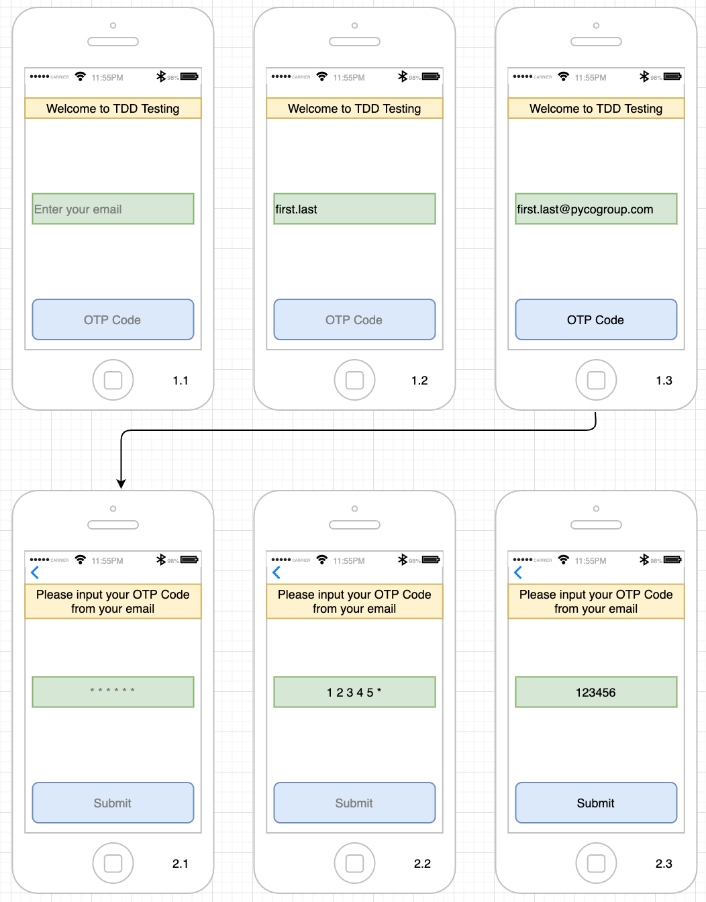

# SimpleUseCase

This repository will help developers to review his skills in a simple use case.

---

## Requirement

- Build a simple application support passwordless email authentication with **MVVM** architecture.
- Detail requirement base on [User Stories](UserStories.md)
- Write unit test to full fill the **Feature 1** in User Stories.

## Exercise

- The application has two screens
  - **InputEmail** allows user input his email to receive OTP Code. When User enter an email correctly and tap *'OTP Code'*. User is taken to the InputOTP screen and receive an OTP Code via his/her email.
  - **InputOTP** allows user input OTP Code that User receives from his/her email to authenticate with server. When User enter an OTP Code and tap *'Submit'*. He sees the popup error|congratulation in case of failure|success.

## Rules
- Follow the contributor rules: https://github.com/PYCOGROUP-VN/README
